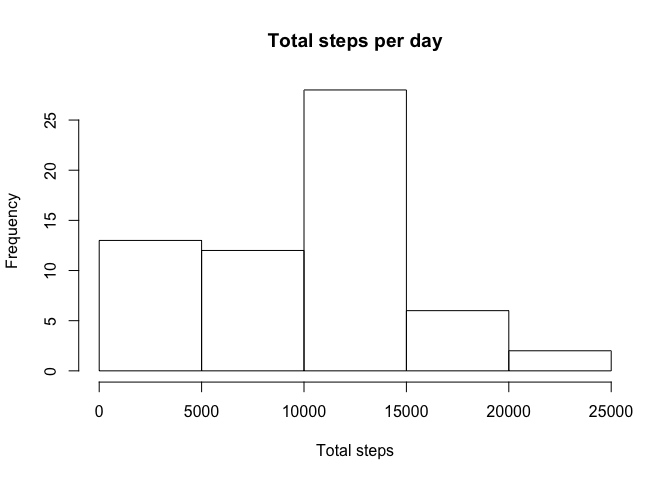
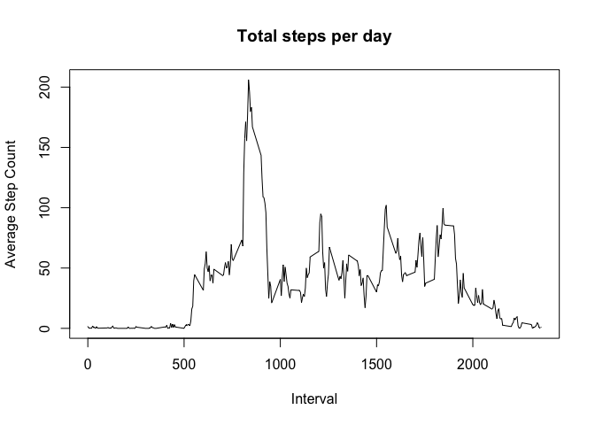
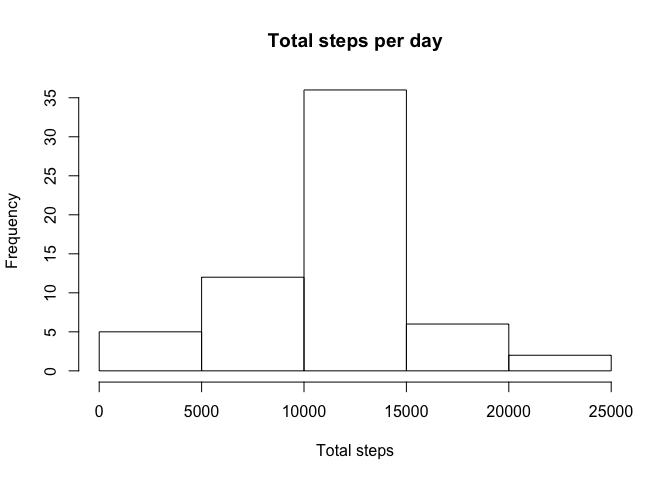
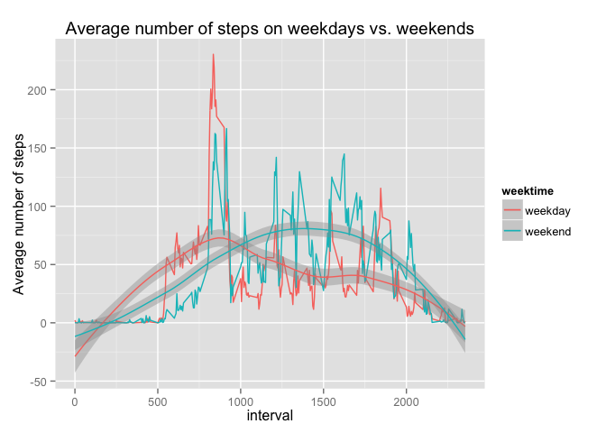

# Repoducible Research Peer Assignment 1


```r
require(knitr)
opts_chunk$set(echo = TRUE, cache = TRUE, cache.path = "cache/", fig.path = "figure/")
```

# 1. Loading and preprocessing the data
        
        

```r
## unzip data
        url <- "https://d396qusza40orc.cloudfront.net/repdata%2Fdata%2Factivity.zip"
        download.file(url,destfile="./data1.zip", method = "curl")

## unzip and read data
        data1 <- unzip ("data1.zip", exdir = "./")
        data <- read.csv(data1, header = T, stringsAsFactors = FALSE)

## load appropriate packages
        library(plyr)   
        library(dplyr)
        library(lubridate)
```


# 2. What is mean total number of steps taken per day?


```r
##summarize by date and take mean step count
        step <- data %>%  group_by(date) %>% summarize(sum(steps, na.rm = TRUE))

## Plot the total steps in histogram
        par(mfrow = c(1,1))
        hist(step$sum, main = "Total steps per day", xlab = "Total steps")
```

 

```r
## Summary statistics of steps 
        summary(step$sum)
```

```
##    Min. 1st Qu.  Median    Mean 3rd Qu.    Max. 
##       0    6778   10400    9354   12810   21190
```


# 3. What is the average daily activity pattern?


```r
## Create a new tidy data frame
        steppat <- step <- data %>%  group_by(interval) %>% summarize(mean(steps, na.rm = TRUE))

## Plot the step pattern
        par(mfrow = c(1,1))
        plot(steppat$interval, steppat$mean, type = "l", xlab = "Interval", 
             ylab = "Average Step Count", main = "Total steps per day")
```

 

- There is a peak of activity around 9 am, mostly steady activity during the afternoon and no activity at night.

# 4. Imputing missing values


```r
## count of rows with missing values
        miss <- data[is.na(data),]
        n <- nrow(miss)
        
##Create new data frame with imputed values
        data_imp <- data ## store data in a new data frame
        a <- rep(steppat$mean, 61) ## create a vector with mean step counts for 61 days
        a[is.na(data$steps)] -> data_imp$steps[is.na(data$steps)] ## replace NA with mean step counts 
        
##sum of steps per day and histogram of the new data set
        step_imp <- data_imp %>%  group_by(date) %>% summarize(sum(steps, na.rm = TRUE))
        par(mfrow = c(1,1))
        hist(step_imp$sum, main = "Total steps per day", xlab = "Total steps")  ##Plot the total steps in histogram
```

 

```r
##summary stats of the new data set
        summary(step_imp$sum)
```

```
##    Min. 1st Qu.  Median    Mean 3rd Qu.    Max. 
##      41    9819   10770   10770   12810   21190
```
- The number of rows with missing values is 2304

- Q: Does imputation of missing values affect the summary statistics?

- A: Yes, while the Mean and Median stay in place, the left side of the distribution is slightly shifted to the right.  


# 5. Are there differences in activity patterns between weekdays and weekends?


```r
## determine the weekdays
        data_imp$date <- ymd(data_imp$date)
        data_wkd <- data_imp %>%  mutate(weekday = weekdays(date)) %>% 
                mutate(weektime = ifelse(weekday == "Saturday" | weekday == "Sunday", "weekend", "weekday"))     
        df <- ddply(data_wkd, c("weektime", "interval"), summarise, mean = mean(steps))

##plot the steps
        library(ggplot2)
        qplot(interval, mean, data = df, col = weektime, geom = c ("line", "smooth"), 
              main = "Average number of steps on weekdays vs. weekends", ylab = "Average number of steps")
```

 


- The activities between weekdays and weekends have different patterns. On weekdays, more steps are made before 10 am, while on weekend, more steps are made after.


##Thank you!
